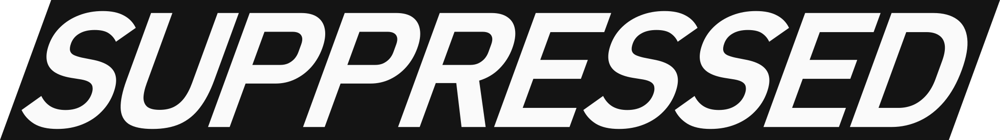

# Standards

Public standards, legal terms, platform disclosures, security practices, operational policies, trademark information, and supporting assets for SUPPRESSED.

The canonical versions are published at [suppressed.com/standards](https://suppressed.com/standards). This repository provides public version history and reference review.

## Contents

- **Terms and policies** — Terms of service, acceptable use, service levels, and platform access conditions.
- **Privacy and data protection** — Privacy, cookie, data processing, and sub-processor disclosures.
- **Security and technology** — Security practices, platform architecture, operational controls, and technical disclosures.
- **Intellectual property** — Trademark information, brand guidance, and public brand assets.

## Repository structure

```text
standards/
├─ 01-terms.mdoc
├─ 02-privacy.mdoc
├─ 03-cookies.mdoc
├─ 04-dpa.mdoc
├─ 05-security.mdoc
├─ 06-sub-processors.mdoc
├─ 07-sla.mdoc
├─ 08-technology.mdoc
├─ 09-ip.mdoc
└─ 10-aup.mdoc

assets/
├─ suppressed.svg
├─ favicon.svg
├─ favicon.ico
└─ bimi.svg
```

## Canonical source

The public website is the canonical presentation layer for SUPPRESSED standards. If there is any inconsistency between this repository and the website version, the website version governs unless SUPPRESSED states otherwise in writing.

## Intellectual property

All materials in this repository are protected intellectual property owned by SUPPRESSED PTE. LTD. Public access does not grant permission to copy, modify, redistribute, commercialize, use for model training, or create derivative works from these materials except as expressly permitted in the repository license.

For permission requests, contact [priv@suppressed.com](mailto:priv@suppressed.com)

© 2026 SUPPRESSED PTE. LTD. All rights reserved.
